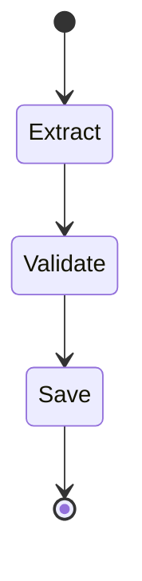

# Pydantic AI 04-03：Pydantic Graph 状态机

> **一句话**：Pydantic Graph 是"**基于 Python type hint 的状态机**"——你把每个步骤写成一个 `BaseNode` 子类，节点之间靠 `run()` 方法的返回类型自动连边，整张图既能跑、又能导出 mermaid 可视化，是 Pydantic AI 推荐的"复杂 Agent 编排"工具。

---

## 1. Agent 不够用的时候

`Agent` 内部已经是一个"工具调用循环"，简单任务一个 Agent 就够了：

```
user msg ──► [Agent loop: LLM ↔ tool calls] ──► output
```

但有些场景，**Agent 内部那个隐式循环 hold 不住**：

- 流程长达十几步，要明确的"提取 → 校验 → 入库 → 通知"四段
- 中间需要人工审批（pause 几小时后从断点继续）
- 不同步骤要换不同模型（小模型干 routine，大模型干判决）
- 想画一张图给非技术同事讲清楚整个 pipeline

这时你需要"显式的状态机"。Pydantic AI 给出的答案不是引一个 LangGraph，而是同厂出品的 **pydantic-graph**。

---

## 2. 设计哲学：节点即类、边即类型

LangGraph 的写法是"先建空图，再 `add_node` / `add_edge` 逐条注册"。Pydantic Graph 反过来：

```python
class FetchUser(BaseNode[State]):
    async def run(self, ctx: GraphRunContext[State]) -> CheckBalance | End[str]:
        ...
```

注意返回类型 `CheckBalance | End[str]`——**它就是这条边**。`pydantic-graph` 启动时扫一遍所有 node 的 return annotation，自动算出整张 DAG，类型不对 IDE 直接红。

| 框架 | 节点定义 | 边定义 | 可视化 |
|------|---------|--------|--------|
| LangGraph | `graph.add_node("name", func)` | `graph.add_edge("a", "b")` | LangGraph Studio |
| **Pydantic Graph** | `class MyNode(BaseNode)` | `run()` 的 **return type** | `graph.mermaid_code()` 直接打 mermaid |

也就是说 **Pydantic Graph 把"图的拓扑"放进类型系统**，你写错连接 mypy/pyright 会立刻告诉你。

---

## 3. 三件套：Node / State / Graph

```python
from pydantic_graph import BaseNode, End, Graph, GraphRunContext
```

### 3.1 State（图的可变状态）

像 Agent 的 `deps` 一样，整张图共享一份 state（通常是 dataclass / Pydantic Model）：

```python
from dataclasses import dataclass, field

@dataclass
class State:
    user_input: str
    extracted: dict = field(default_factory=dict)
    score: float = 0.0
    history: list[str] = field(default_factory=list)
```

### 3.2 Node（图的步骤）

每个步骤是一个 dataclass，继承 `BaseNode[StateT, DepsT, OutT]`：

```python
@dataclass
class Extract(BaseNode[State]):
    async def run(self, ctx: GraphRunContext[State]) -> Validate:
        # 读 state、写 state、调 Agent、调 DB……
        ctx.state.extracted = {"amount": 1280}
        ctx.state.history.append("extracted")
        return Validate()    # ← 返回下一个 node
```

要"结束图"就返回 `End`：

```python
@dataclass
class Validate(BaseNode[State, None, str]):
    async def run(self, ctx: GraphRunContext[State]) -> End[str]:
        return End(f"ok: {ctx.state.extracted}")
```

`End[str]` 表示图的最终输出是 `str`。

### 3.3 Graph（组装并运行）

```python
graph = Graph(nodes=[Extract, Validate])

state = State(user_input="发票：阿里云 ¥1280")
result = await graph.run(Extract(), state=state)
print(result.output)    # End 携带的值
print(state.history)    # 节点改写过的 state
```

注意：

- `Graph(nodes=[...])` 只是注册节点列表，**不需要写边**
- `run(Extract(), state=...)` 传入起始节点和初始 state
- 返回的 `GraphRunResult` 含 `output`、`state`、`history`

---

## 4. 完整最小例子：找下一个被 5 整除的数

来自官方文档，最小可跑：

```python
from __future__ import annotations
from dataclasses import dataclass
from pydantic_graph import BaseNode, End, Graph, GraphRunContext

@dataclass
class DivisibleBy5(BaseNode[None, None, int]):
    foo: int

    async def run(self, ctx: GraphRunContext) -> Increment | End[int]:
        if self.foo % 5 == 0:
            return End(self.foo)
        return Increment(self.foo)

@dataclass
class Increment(BaseNode):
    foo: int

    async def run(self, ctx: GraphRunContext) -> DivisibleBy5:
        return DivisibleBy5(self.foo + 1)

graph = Graph(nodes=[DivisibleBy5, Increment])

async def main():
    result = await graph.run(DivisibleBy5(foo=4))
    print(result.output)   # 5
```

观察点：

1. `Increment` 返回 `DivisibleBy5`，`DivisibleBy5` 返回 `Increment | End[int]`——这就是循环
2. 没有 state、没有 deps，最简结构
3. 整个调度由 `pydantic-graph` 自动完成

---

## 5. Deps 依赖注入

和 `Agent` 一模一样的设计：

```python
@dataclass
class Deps:
    db: DB
    http: httpx.AsyncClient

@dataclass
class Save(BaseNode[State, Deps]):
    async def run(self, ctx: GraphRunContext[State, Deps]) -> End[str]:
        await ctx.deps.db.insert(ctx.state.extracted)
        return End("saved")

graph = Graph(nodes=[Extract, Validate, Save])
result = await graph.run(
    Extract(),
    state=State(user_input="..."),
    deps=Deps(db=..., http=...),
)
```

好处和 Agent 一样：写单元测试时换一个假 `Deps` 就能跑全图。

---

## 6. 节点里调用 Agent

最常见的"图 + Agent"组合，每个节点内部都可以塞一个 Agent：

```python
from pydantic_ai import Agent

extract_agent = Agent("openai:gpt-4o-mini", output_type=Invoice)
notify_agent = Agent("openai:gpt-4o-mini", output_type=str)

@dataclass
class Extract(BaseNode[State]):
    async def run(self, ctx: GraphRunContext[State]) -> Validate:
        r = await extract_agent.run(ctx.state.user_input)
        ctx.state.extracted = r.output.model_dump()
        return Validate()
```

不同节点可以用不同 model（小步骤用 mini、关键判决用 GPT-4o），这是 Graph 比单 Agent 灵活的地方。

---

## 7. 导出 Mermaid 可视化

```python
print(graph.mermaid_code(start_node=Extract))
```

输出（贴到 https://mermaid.live 里看）：



这一条命令就把"图的拓扑给产品同学讲清楚"的需求解决了，特别适合放进设计文档 / PR 描述里。

---

## 8. 状态持久化（断点恢复）

Pydantic Graph 内置持久化抽象 `BaseStatePersistence`：

```python
from pydantic_graph.persistence.file import FileStatePersistence

persist = FileStatePersistence(Path("run.json"))

# 第一次跑（可能因为人工审批中断）
async with graph.iter(Extract(), state=state, persistence=persist) as it:
    async for node in it:
        if isinstance(node, WaitForApproval):
            break    # 跳出，去等人工

# ... 几小时后人工点了通过 ...
async with graph.iter_from_persistence(persistence=persist) as it:
    async for node in it:
        ...        # 从中断处继续
```

内置实现有 `FileStatePersistence`、`SimpleStatePersistence`，也可以自己写一个对接 DB / Redis。

---

## 9. vs LangGraph 横向对比

| 维度 | Pydantic Graph | LangGraph |
|------|---------------|-----------|
| 节点定义 | `class Node(BaseNode)` | `def func(state) -> dict` |
| 边定义 | **return type** 隐式 | `add_edge` / `add_conditional_edges` 显式 |
| State 类型 | dataclass / Pydantic Model | `TypedDict` + reducer |
| 并发节点 | 同时 return 多个 / 用 task group | `add_node(parallel=True)` |
| 持久化 | `BaseStatePersistence` | `Checkpointer`（SQLite/Postgres 内置） |
| 可视化 | `.mermaid_code()` | LangGraph Studio |
| 与 Agent 关系 | 同厂 `pydantic-ai` 无缝 | 同厂 `langchain` 无缝 |
| 生态 | 新，工具少 | 老，模板/例子多 |
| 类型安全 | ✅ 一等公民 | ⚠️ TypedDict 部分支持 |

**简短结论**：

- 已经用 Pydantic AI、追求类型 → Pydantic Graph
- 已经用 LangChain、需要丰富 checkpointer/中间件 → LangGraph
- 两者都能解决"有状态长流程"，技术上不冲突，主要是**生态对齐成本**

---

## 10. 实战：发票处理工作流

下面是 demo 里的完整流程：

```
[user msg] ──► Extract ──► Validate ─┬─► Save ──► Notify ──► [End]
                              │
                              └─► Reject ──► [End]
```

代码：

```python
@dataclass
class State:
    raw: str
    invoice: Invoice | None = None
    saved_id: int | None = None
    log: list[str] = field(default_factory=list)

@dataclass
class Extract(BaseNode[State]):
    async def run(self, ctx) -> Validate:
        r = await extract_agent.run(ctx.state.raw)
        ctx.state.invoice = r.output
        ctx.state.log.append("extracted")
        return Validate()

@dataclass
class Validate(BaseNode[State]):
    async def run(self, ctx) -> Save | Reject:
        if ctx.state.invoice.amount > 0:
            return Save()
        return Reject(reason="金额非正")

@dataclass
class Save(BaseNode[State]):
    async def run(self, ctx) -> Notify:
        ctx.state.saved_id = 42      # fake DB
        ctx.state.log.append(f"saved id={ctx.state.saved_id}")
        return Notify()

@dataclass
class Notify(BaseNode[State, None, str]):
    async def run(self, ctx) -> End[str]:
        return End(f"已入库 id={ctx.state.saved_id}")

@dataclass
class Reject(BaseNode[State, None, str]):
    reason: str
    async def run(self, ctx) -> End[str]:
        return End(f"拒绝：{self.reason}")

graph = Graph(nodes=[Extract, Validate, Save, Notify, Reject])
```

可视化：

```
[*] --> Extract
Extract --> Validate
Validate --> Save
Validate --> Reject
Save --> Notify
Notify --> [*]
Reject --> [*]
```

---

## 11. 何时用 Graph，何时只用 Agent

| 场景 | 用 Agent | 用 Graph |
|------|---------|---------|
| 一问一答、模型自己决定调几次工具 | ✅ | — |
| 步骤明确、人能画出泳道图 | — | ✅ |
| 有"人工审批 / 等回调 / 几小时后继续"的中断 | — | ✅ |
| 不同步骤用不同 model | — | ✅ |
| 想给非技术同事画一张流程图 | — | ✅（mermaid） |
| 想强类型保证步骤连接 | — | ✅ |
| 一次性脚本、临时业务 | ✅ | — |

**两个一起用**最常见：用 Graph 编排整体流程，每个 node 内部塞一个 Agent。

---

## 12. 常见坑

| 现象 | 原因 | 解决 |
|------|------|------|
| `Node A` 返回 `Node B` 但图里没找到 B | `Graph(nodes=[...])` 漏了 B | 把所有 node 都加进去 |
| 类型检查报"return type mismatch" | 节点声明的返回类型和实际不一致 | 改 annotation 或 return |
| 死循环跑爆 | 节点之间无终止条件 | 加 `max_steps` 或确保有 `End` 分支 |
| state 改了但下个节点看不到 | 用了 immutable model + 返回新对象 | 直接 mutate `ctx.state`，pydantic-graph 不会替你做不可变 |
| 并发节点共享 state 写冲突 | 多 task 同时写同一字段 | 用 asyncio Lock 或拆字段 |
| 持久化 resume 后 state 字段对不上 | 改了 dataclass 字段但旧文件还在 | 加版本号字段、做 migration |
| Mermaid 里看不到某条边 | 节点 return type 用了 `Any` 或字符串 | 用 `Union` 显式列出所有可能 node 类 |
| 单元测试不好写 | 直接跑全图很重 | 单独 `await Node().run(ctx)` 测一个 node |
| Logfire 看不到内部步骤 | 没 instrument | `logfire.instrument_pydantic_ai()` 也覆盖 graph 内的 Agent |

---

## 13. 子图与嵌套

把一个图当成另一个图的节点。最简单做法是写一个"调用子图的 node"：

```python
@dataclass
class RunSubgraph(BaseNode[State]):
    async def run(self, ctx) -> NextNode:
        sub_state = SubState(...)
        sub_result = await sub_graph.run(SubStart(), state=sub_state)
        ctx.state.sub_result = sub_result.output
        return NextNode()
```

避免把所有逻辑塞一张大图，**拆 3-5 个节点的子图**比 20 节点的巨图好维护得多。

---

## 14. 本章 demo

完整可运行代码：[`demos/modules/03_graph.py`](../../demos/modules/03_graph.py)

里面包含：

1. **Demo A**：发票处理 5 节点工作流（Extract → Validate → Save / Reject → Notify）
2. **Demo B**：导出 mermaid_code 打印出图的拓扑
3. 没 API Key 时所有 Agent 自动 fallback 到 `TestModel`，整图照样跑通

下一篇：[04-logfire.md](04-logfire.md) —— 给 Agent / Graph / Tool 全链路加 trace。
