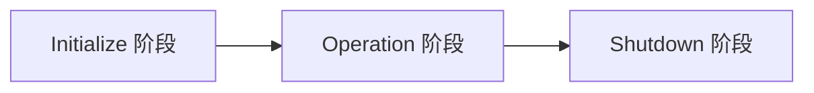

# MCP 04：协议生命周期 —— JSON-RPC、握手、能力协商

> **一句话**：MCP 在协议层就是「JSON-RPC 2.0 + 一次三步握手 + 能力（capabilities）协商」。把这三件事讲清，你看任何 MCP 流量就和看 HTTP 请求一样轻松。

---

## 1. JSON-RPC 2.0 速通

MCP 完全沿用 JSON-RPC 2.0 的消息格式，没有任何魔改。一共四种消息：

### 1.1 Request（请求）
```json
{
  "jsonrpc": "2.0",
  "id": 1,
  "method": "tools/list",
  "params": { /* 可选 */ }
}
```

要点：
- `jsonrpc` 必须等于字符串 `"2.0"`
- `id` 任意（数字或字符串），但同一会话里要唯一，用来匹配响应
- `method` 是命名空间风格，斜杠分层（`tools/list`、`resources/read`、`notifications/initialized`）

### 1.2 Response（成功响应）
```json
{
  "jsonrpc": "2.0",
  "id": 1,
  "result": { /* 任意结构 */ }
}
```

`id` 必须等于请求里的 `id`。

### 1.3 Error（错误响应）
```json
{
  "jsonrpc": "2.0",
  "id": 1,
  "error": {
    "code": -32602,
    "message": "Invalid params",
    "data": { /* 可选附加信息 */ }
  }
}
```

标准错误码（来自 JSON-RPC 规范）：

| code | 含义 |
|------|------|
| -32700 | Parse error（JSON 解析失败） |
| -32600 | Invalid Request（不是合法 JSON-RPC） |
| -32601 | Method not found |
| -32602 | Invalid params |
| -32603 | Internal error |
| -32000 ~ -32099 | Server 自定义错误区段 |

MCP 还约定了若干**应用层错误**（写在 `data` 字段里），详见 02-server/08-errors-validation。

### 1.4 Notification（通知）
```json
{
  "jsonrpc": "2.0",
  "method": "notifications/initialized",
  "params": { /* 可选 */ }
}
```

**关键区别：没有 `id`**。发送方不期望响应。

MCP 里所有 `notifications/*` 命名空间的消息都是通知。

### 1.5 批处理
JSON-RPC 2.0 支持把多条消息打包成数组发送：

```json
[
  {"jsonrpc":"2.0","id":1,"method":"tools/list"},
  {"jsonrpc":"2.0","id":2,"method":"resources/list"}
]
```

但 **MCP 2025-11-25 规范明确不要求 Server 支持批处理**，实际上多数 Server 不支持。日常写代码不用考虑批处理。

---

## 2. MCP 是有状态协议

JSON-RPC 本身是无状态的，但 MCP 在它之上加了**会话**概念：

```
[stateless JSON-RPC]   →   [stateful MCP session]
                            ↓
                  必须先 initialize 才能用任何能力
```

会话状态包括：
- 协议版本（initialize 时协商）
- 能力清单（initialize 时双方各报）
- 订阅列表（resources/subscribe 后维护）
- 进度令牌、任务 ID、消息 ID 计数器

**结论**：一次 stdio 连接 = 一次会话；一次 HTTP `Mcp-Session-Id` = 一次会话。会话断开，状态清零，必须重新 initialize。

> 2025-11-25 规范引入了**无状态 MCP**（SEP-2575/2567）作为选项，远程 Server 可以选择不维护会话状态。但默认仍然是有状态。

---

## 3. 生命周期三阶段



### 3.1 Initialize 阶段（必须）

三步握手：

```
Client                              Server
  │                                   │
  │ ① initialize Request              │
  ├──────────────────────────────────>│
  │                                   │
  │ ② initialize Result               │
  │<──────────────────────────────────┤
  │                                   │
  │ ③ notifications/initialized       │
  ├──────────────────────────────────>│
  │                                   │
  │       ⇩ 进入 Operation 阶段        │
```

完整 JSON 流量见第 4 节。

### 3.2 Operation 阶段
握手成功后，**任何方向**都可以发任何已协商能力的请求。

约束：
- 必须**只用协商成功的 capabilities**
- 必须**用协商成功的 protocolVersion**
- HTTP 传输下，**每个后续请求**都要带 `MCP-Protocol-Version: <version>` 头

### 3.3 Shutdown 阶段
MCP 没有定义 shutdown 消息。直接靠传输层断开：

- **stdio**：Client 关闭 Server 的 stdin → 等 Server 退出 → 超时 SIGTERM → 再超时 SIGKILL
- **HTTP**：关闭 HTTP 连接 / 释放 session id

---

## 4. 完整握手 JSON 流量（看一次就懂）

### Step 1: Client → Server: initialize Request

```json
{
  "jsonrpc": "2.0",
  "id": 1,
  "method": "initialize",
  "params": {
    "protocolVersion": "2025-11-25",
    "capabilities": {
      "roots": { "listChanged": true },
      "sampling": {},
      "elicitation": {
        "form": {},
        "url": {}
      },
      "tasks": {
        "requests": {
          "elicitation": { "create": {} },
          "sampling":    { "createMessage": {} }
        }
      }
    },
    "clientInfo": {
      "name": "claude-code",
      "title": "Claude Code",
      "version": "1.0.0",
      "description": "Anthropic 官方 CLI",
      "icons": [
        {"src":"https://example.com/icon.png","mimeType":"image/png","sizes":["48x48"]}
      ],
      "websiteUrl": "https://claude.com/claude-code"
    }
  }
}
```

逐字段解释：

| 字段 | 含义 |
|------|------|
| `protocolVersion` | Client 支持的**最新**版本（YYYY-MM-DD 格式） |
| `capabilities` | Client 能力清单——下一节详细展开 |
| `clientInfo` | 标识自己是谁。`icons` / `websiteUrl` 是 2025-11-25 新增 |

### Step 2: Server → Client: initialize Result

```json
{
  "jsonrpc": "2.0",
  "id": 1,
  "result": {
    "protocolVersion": "2025-11-25",
    "capabilities": {
      "logging": {},
      "prompts": { "listChanged": true },
      "resources": {
        "subscribe": true,
        "listChanged": true
      },
      "tools": { "listChanged": true },
      "tasks": {
        "list": {},
        "cancel": {},
        "requests": {
          "tools": { "call": {} }
        }
      }
    },
    "serverInfo": {
      "name": "github-mcp",
      "title": "GitHub MCP Server",
      "version": "2.1.0"
    },
    "instructions": "可在 system prompt 里提示模型：本服务能调 GitHub API，但写操作前要确认仓库权限。"
  }
}
```

注意：

- `instructions` 字段（可选）：Server 给 Host 的"使用说明"。Host 可以塞进 system prompt 帮模型理解此服务
- Server 返回的 `protocolVersion` **必须**等于 Client 请求的版本（如果支持），否则返回 Server 支持的最新版本，让 Client 决定是否断开

### Step 3: Client → Server: notifications/initialized

```json
{
  "jsonrpc": "2.0",
  "method": "notifications/initialized"
}
```

发完这条，会话才正式可用。**Server 必须等到收到 initialized 通知才能发其他请求**（ping 和 logging 例外）。

### Step 4 起：Operation 阶段

之后任何方向都可以发请求：

```json
// Client → Server
{"jsonrpc":"2.0","id":2,"method":"tools/list"}

// Server → Client（反向请求 sampling）
{"jsonrpc":"2.0","id":100,"method":"sampling/createMessage","params":{...}}
```

---

## 5. Capabilities 全表

`capabilities` 是 initialize 阶段最关键的对象。双方各声明一份，**只有都声明了某个能力，对应消息才能用**。

### 5.1 Client capabilities

| 字段 | 子字段 | 含义 |
|------|--------|------|
| `roots` | `listChanged: bool` | 我能告诉你可访问的根目录，且变更时通知你 |
| `sampling` | — | 我能帮你调 LLM |
| `elicitation` | `form: {}`、`url: {}` | 我能向用户索取信息（form：结构化表单；url：跳到外部 URL，2025-11-25 新增） |
| `tasks` | `requests: {...}` | 我支持对你的请求做"任务化"（异步 + 可取消） |
| `experimental` | (任意) | 非标准的实验能力 |

### 5.2 Server capabilities

| 字段 | 子字段 | 含义 |
|------|--------|------|
| `tools` | `listChanged: bool` | 我有工具，且会在工具列表变化时通知你 |
| `resources` | `listChanged: bool`、`subscribe: bool` | 我有资源 / 资源变更可订阅 |
| `prompts` | `listChanged: bool` | 我有 Prompts |
| `logging` | — | 我能发日志通知给你 |
| `completions` | — | 我支持参数补全 |
| `tasks` | `list: {}`、`cancel: {}`、`requests: {...}` | 我支持任务管理 |
| `experimental` | (任意) | 实验能力 |

### 5.3 一个简单的协商例子

Client 说：
```json
{"capabilities": {"sampling": {}}}
```
Server 说：
```json
{"capabilities": {"tools": {"listChanged": true}, "resources": {"subscribe": true}}}
```

协商结果：
- ✅ Server 可以 `sampling/createMessage`（Client 声明了 sampling）
- ✅ Server 可以发 `notifications/tools/list_changed`（Server 自己声明的）
- ✅ Client 可以 `resources/subscribe`（Server 声明了 subscribe）
- ❌ Server 不能 `elicitation/create`（Client 没声明 elicitation）
- ❌ Server 不能发 `notifications/resources/updated`（Server 没声明 subscribe）

---

## 6. 版本协商

`protocolVersion` 用 **YYYY-MM-DD** 日期格式（不是 SemVer）。截至本手册时间：

| 版本 | 发布 |
|------|------|
| `2024-11-05` | 第一版正式 spec |
| `2025-03-26` | Streamable HTTP 取代 HTTP+SSE 双端点 |
| `2025-06-18` | 大幅扩展、authorization 章节 |
| `2025-11-25` | **当前最新**，引入 Tasks 扩展、MCP Apps 等 |

协商流程：

1. Client 发自己支持的**最新**版本
2. 如果 Server 也支持 → 返回同一版本
3. 如果 Server 不支持 → 返回 Server 自己的**最新**版本
4. Client 不接受 Server 返回的版本 → 断开
5. 协商成功后，HTTP 传输下的每个请求都必须带 `MCP-Protocol-Version: 2025-11-25` 头

> 已经在用 MCP 的项目要做版本升级，对照官方 changelog 检查 breaking change：https://modelcontextprotocol.io/specification/2025-11-25/changelog

---

## 7. 超时 / 重试 / 心跳

### 7.1 超时
每个请求都应该有超时。SDK 默认值通常是 30~60 秒。建议：
- 工具调用单独配，慢工具（爬虫、大模型）放宽到 5-10 分钟
- 收到对应请求的 `notifications/progress` 时**可以重置**超时（但要有最大上限防滥用）

超时后**应该**发取消通知：

```json
{
  "method": "notifications/cancelled",
  "params": {"requestId": 42, "reason": "timeout"}
}
```

### 7.2 重试
JSON-RPC 是 stateful 的，重试 = 重发相同请求。但是：

- **幂等请求**（list、read、get）可以放心重试
- **写工具**（call 副作用工具）**不要**自动重试，等用户决策

### 7.3 心跳 / 健康检查
MCP 定义了 `ping` 请求，双向都能发：

```json
{"jsonrpc":"2.0","id":99,"method":"ping"}
{"jsonrpc":"2.0","id":99,"result":{}}
```

用于：
- 长时间空闲后探测对方是否还活着
- HTTP SSE 流保活

---

## 8. Python SDK 里看到的样子

SDK 把上面所有协议细节封装成几个高层 API：

```python
import asyncio
from mcp import ClientSession, StdioServerParameters
from mcp.client.stdio import stdio_client

async def main():
    params = StdioServerParameters(command="python", args=["server.py"])

    async with stdio_client(params) as (read, write):
        async with ClientSession(read, write) as session:
            # 1. initialize 请求 + 等响应 + 发 initialized 通知（一行）
            init = await session.initialize()

            print(f"协议版本: {init.protocolVersion}")
            print(f"Server: {init.serverInfo.name}")
            print(f"Server 能力: {init.capabilities}")
            print(f"Server 提示: {init.instructions}")

            # 2. 列工具
            tools = await session.list_tools()

            # 3. 调工具
            result = await session.call_tool("add", {"a": 1, "b": 2})

            # 4. 退出 (async with 自动关闭传输)

asyncio.run(main())
```

`session.initialize()` 一行做了三步握手。SDK 会自动：
- 选择最新支持的 `protocolVersion`
- 根据 `ClientSession` 注册的回调推导 Client capabilities（你注册了 sampling 回调 → 自动声明 sampling 能力）
- 发 `notifications/initialized`

写 Server 也类似：

```python
from mcp.server.fastmcp import FastMCP

mcp = FastMCP("demo")

@mcp.tool()
def hello(name: str) -> str:
    return f"Hello, {name}!"

# FastMCP 自动声明 tools.listChanged，自动响应 initialize，自动回复 server capabilities
mcp.run()
```

你**几乎不用写一行协议级代码**。但理解协议层在做什么，能在调试时秒级定位问题。

---

## 9. 用 Inspector 看真实流量

启 Server：

```bash
npx @modelcontextprotocol/inspector python server.py
```

打开浏览器后切到 "**Notifications**" / "**Console**" 标签，能看到完整的 JSON-RPC 流量：

```
[12:00:01] → initialize {protocolVersion: "2025-11-25", capabilities: ...}
[12:00:01] ← initialize {protocolVersion: "2025-11-25", serverInfo: ...}
[12:00:01] → notifications/initialized
[12:00:02] → tools/list
[12:00:02] ← {tools: [...]}
[12:00:03] → tools/call {name: "add", arguments: {a:1,b:2}}
[12:00:03] ← {content: [{type:"text",text:"3"}]}
```

调试卡死时 Inspector 是你的眼睛——直接看下一条请求发了没、Server 是不是在等什么。

---

## 10. 常见坑

| 坑 | 排查 |
|----|------|
| **Server 不响应任何请求** | 90% 是 Server 进程 stdout 被 `print()` 污染了 |
| **Initialize 后报 method not found** | Client 调用的能力 Server 没在 capabilities 里声明 |
| **协议版本不兼容** | 看 Inspector 的 `protocolVersion` 字段，必要时锁版本 |
| **`notifications/initialized` 没发** | Client 端用 raw socket 写代码时常忘——SDK 会自动发 |
| **id 冲突** | 同一会话里 id 必须唯一。SDK 自动用递增计数 |
| **HTTP 请求没带 `MCP-Protocol-Version` 头** | 远程 MCP 服务可能直接拒绝 |

---

## 11. 下一步

- 🛠️ 安装 SDK + Inspector → [05-installation.md](./05-installation.md)
- 🛠️ Hello World Server → [06-first-server.md](./06-first-server.md)
- 🔍 传输层细节 → 03-client/02-transports
- 🔍 错误处理 → 02-server/08-errors-validation

## 参考资料

- Lifecycle spec：https://modelcontextprotocol.io/specification/2025-11-25/basic/lifecycle
- JSON-RPC 2.0：https://www.jsonrpc.org/specification
- Architecture：https://modelcontextprotocol.io/docs/learn/architecture
