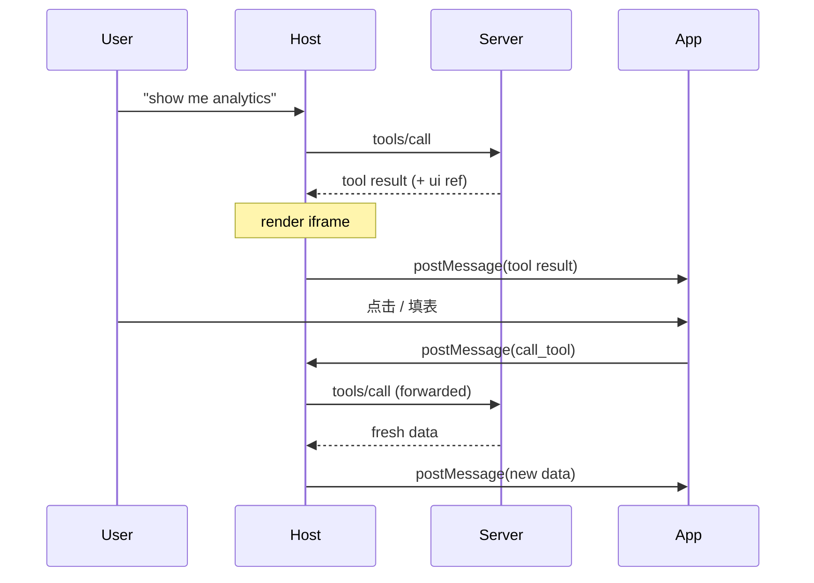

# MCP Advanced 01：MCP Apps —— 在客户端里嵌可交互 UI

> **一句话**：MCP Apps 让 Server 返回的不只是文字 / JSON，而是**一个跑在沙盒 iframe 里的完整 HTML 应用**——图表可点、表单可填、3D 模型可旋转。Server 把 UI 资源（HTML + JS + CSS）声明在 Tool 描述里，Host（Claude Desktop / VS Code）拿到后渲染。这是 2025-Q4 引入的扩展，让 MCP 从"聊天工具"升级到"应用平台"。

> ⚠️ **状态**：MCP Apps 是 spec extension（不是核心规范），SDK 与 Host 支持仍在快速演进。本篇讲核心思想 + Server 端落地骨架。

---

## 1. 为什么需要 MCP Apps

MCP 工具默认返回 text / image / structured content——这些放在对话里阅读 OK，但**交互**就够呛：

- 看销售数据：文字列表 vs 可点的热力图
- 配 deploy：用对话往返问 vs 一张表单
- 看 PDF：让模型描述 vs 嵌入 PDF Viewer
- 监控 dashboard：每次问"现在咋样" vs 实时刷新

传统方案是给用户一个 URL 跳页面。但是：

- 跳出对话，丢上下文
- 数据双向流动要 Server 自己实现 API + 鉴权
- 安全要自己保证
- 一份 UI 写给所有 Host 适配

MCP Apps 把这些问题解决到协议层。

---

## 2. 基本流程

```
1. LLM 决定调用一个 Tool
2. Tool description 里有 _meta.ui.resourceUri
   → Host 提前 fetch 那个 ui:// resource
3. Tool 执行返回数据（不是 text，是给 UI 渲染的）
4. Host 在 sandboxed iframe 里加载 HTML
5. Host 通过 postMessage 把 tool result 注入 iframe
6. 用户在 iframe 里交互
7. iframe 用 postMessage 反过来调 MCP Tool（host 转发）
8. Tool 拿到新数据 → 推回 iframe → UI 更新
```



---

## 3. 安全模型

UI 跑在 **sandboxed iframe**：

- 不能访问父页面 DOM
- 不能读 Host 的 cookie / localStorage
- 不能跳转父页面
- 所有通信走 postMessage（结构化数据，不能跑任意脚本到父域）

Host 控制 iframe 能调哪些工具 / 能不能打开外链。这让 Host 安全地渲染**第三方 Server** 的 UI。

---

## 4. Server 端怎么写

最小骨架（伪代码，具体 SDK API 看 `@modelcontextprotocol/ext-apps` 文档）：

```python
from mcp.server.fastmcp import FastMCP

mcp = FastMCP("dashboard-app")


@mcp.resource("ui://chart", mime_type="text/html")
def chart_ui() -> str:
    """返回 chart 用的 HTML（含 JS / CSS）"""
    return """
<!DOCTYPE html>
<html>
<head>
  <script src="https://cdn.jsdelivr.net/npm/chart.js"></script>
</head>
<body>
  <canvas id="c"></canvas>
  <script>
    window.addEventListener('message', (e) => {
      if (e.data.type === 'tool_result') {
        new Chart(document.getElementById('c'), {
          type: 'bar',
          data: e.data.payload,
        });
      }
    });
    // 通知 Host 已就绪
    parent.postMessage({type: 'ready'}, '*');
  </script>
</body>
</html>
"""


@mcp.tool(
    # 关键：在 Tool 的 _meta 里声明 UI 资源
    annotations={
        "io.modelcontextprotocol.ui": {
            "resourceUri": "ui://chart",
            "csp": {
                "script-src": ["https://cdn.jsdelivr.net"]
            }
        }
    }
)
async def show_sales_chart(period: str = "month") -> dict:
    """显示销售柱状图"""
    return {
        "labels": ["1月", "2月", "3月"],
        "datasets": [{"label": "销售额", "data": [120, 190, 300]}],
    }


if __name__ == "__main__":
    mcp.run()
```

> 具体的 `_meta.ui` 字段命名、CSP 字段、postMessage 协议以 `@modelcontextprotocol/ext-apps` 官方 spec 为准。本节给出的是概念骨架。

---

## 5. Client / Host 端要做的事

写 Host 想支持 MCP Apps：

1. **fetch UI resource**：看到 tool description 里有 `ui.resourceUri` → 提前拉
2. **sandboxed iframe**：`<iframe sandbox="allow-scripts">` 加载 HTML
3. **postMessage bridge**：让 iframe 能反过来调 tool（受限白名单）
4. **CSP enforcement**：按 `_meta.ui.csp` 限制 iframe 能加载哪些外部资源
5. **生命周期**：tool 调用 / 对话结束时清理 iframe

参考 SDK：`@mcp-ui/client`（React 组件）或 `@modelcontextprotocol/ext-apps` 的 `AppBridge`。

---

## 6. 适合 / 不适合

### 适合
- **数据探索**：地图、热力图、可下钻的图表
- **多选项配置**：deploy 表单、scenario modeler
- **富媒体**：PDF、3D、视频、shader、音频
- **实时监控**：dashboard、log tail
- **多步审批**：expense / PR / issue triage

### 不适合
- 只是一句答案的简单工具（用 text）
- 需要跨对话持续存在的应用（用独立 Web 应用）
- 极敏感操作（iframe 沙盒不是终极隔离）

---

## 7. vs Elicitation

二者都涉及 UI 交互，但定位完全不同：

| 维度 | Elicitation | MCP Apps |
|------|-------------|----------|
| 主导 | Server 拉用户 | Server 渲染应用 |
| UI | 简单表单 | 任意 HTML/JS |
| 触发 | 工具执行中途 | 工具返回时 |
| 复杂度 | 低（声明 schema 即可） | 高（要写前端） |
| 适合 | 几个字段的确认 | 完整可视化界面 |

---

## 8. 工具链与生态

- **Server 端 SDK**：`@modelcontextprotocol/ext-apps`（Node）/ 各语言陆续跟进
- **Client 端**：`@mcp-ui/client`（React）、`AppBridge`（vanilla）
- **示例库**：[ext-apps/examples](https://github.com/modelcontextprotocol/ext-apps/tree/main/examples) —— map / threejs / shadertoy / PDF / 音频转写 等
- **Skills**：Anthropic 出了 `build-mcp-app` skill 帮你 scaffold

---

## 9. Python SDK 的支持

写作时（2026-05），Python `mcp` SDK 对 MCP Apps 的支持还在跟进。建议：

- **Tool 元数据**：手动在 `annotations` 里加 `io.modelcontextprotocol.ui` 字段
- **UI Resource**：用 `@mcp.resource("ui://...")` 注册 HTML 资源
- **postMessage 协议**：参考 ext-apps spec 在前端实现

如果你重度使用 MCP Apps，建议关注：
- https://github.com/modelcontextprotocol/python-sdk
- https://github.com/modelcontextprotocol/ext-apps

---

## 10. 简单 demo：QR 码生成器

```python
# demos/advanced/01_mcp_app_qr.py
"""Server 端用 MCP App 渲染 QR 码生成器（骨架）"""
from mcp.server.fastmcp import FastMCP

mcp = FastMCP("qr-app")


@mcp.resource("ui://qr", mime_type="text/html")
def qr_ui() -> str:
    return """
<!DOCTYPE html>
<html>
<head><script src="https://cdn.jsdelivr.net/npm/qrcode@1.5/build/qrcode.min.js"></script></head>
<body style="font-family:system-ui;padding:20px;">
  <input id="text" placeholder="输入要编码的内容" style="width:300px;padding:8px;">
  <button onclick="render()">生成</button>
  <canvas id="canvas"></canvas>
  <script>
    function render() {
      const text = document.getElementById('text').value;
      QRCode.toCanvas(document.getElementById('canvas'), text);
    }
    window.addEventListener('message', (e) => {
      if (e.data.type === 'tool_result') {
        document.getElementById('text').value = e.data.payload.text;
        render();
      }
    });
  </script>
</body>
</html>
"""


@mcp.tool(
    annotations={
        "io.modelcontextprotocol.ui": {
            "resourceUri": "ui://qr",
            "csp": {"script-src": ["https://cdn.jsdelivr.net"]},
        }
    }
)
def show_qr(text: str) -> dict:
    """生成 QR 码（Host 渲染交互式 UI）"""
    return {"text": text}


if __name__ == "__main__":
    mcp.run()
```

在支持 MCP Apps 的 Host（Claude Desktop / VS Code）里调用，会看到嵌入的 QR 生成器界面，用户能在里头改文本重新生成。

---

## 11. 设计建议

- **UI 资源体积小**：iframe 加载慢用户感知差
- **样式自洽**：不依赖父页面，自带 CSS
- **响应式**：iframe 宽度可能很小
- **明确 CSP**：声明能加载哪些外部资源
- **优雅降级**：Host 不支持 MCP Apps 时，Tool 还能返回 text 让模型解释
- **postMessage 双向通信防御**：永远校验 origin 和数据类型

---

## 12. 常见坑

| 坑 | 排查 |
|----|------|
| **Host 没渲染 iframe** | 客户端不支持 MCP Apps；看官方 [client matrix](https://modelcontextprotocol.io/extensions/client-matrix) |
| **iframe 加载失败** | CSP 太严 / 外部 CDN 没在白名单 |
| **iframe 调不了 tool** | postMessage 没正确实现 / Host 限制了 tool 白名单 |
| **样式爆炸** | iframe 不继承父样式，要自带 reset.css |
| **大小不合适** | 用 viewport meta + 媒体查询适配 |

---

## 13. 下一步

- 📖 Agent Skills 集成 → [02-agent-skills.md](./02-agent-skills.md)
- 📖 MCP Registry 发布 → [03-registry.md](./03-registry.md)
- 🛠️ 实战项目 → 07-practice

## 参考资料

- MCP Apps 概览：https://modelcontextprotocol.io/extensions/apps/overview
- MCP Apps Spec：https://apps.extensions.modelcontextprotocol.io
- ext-apps 仓库：https://github.com/modelcontextprotocol/ext-apps
- SEP-1865 MCP Apps：https://modelcontextprotocol.io/seps/1865-mcp-apps-interactive-user-interfaces-for-mcp
